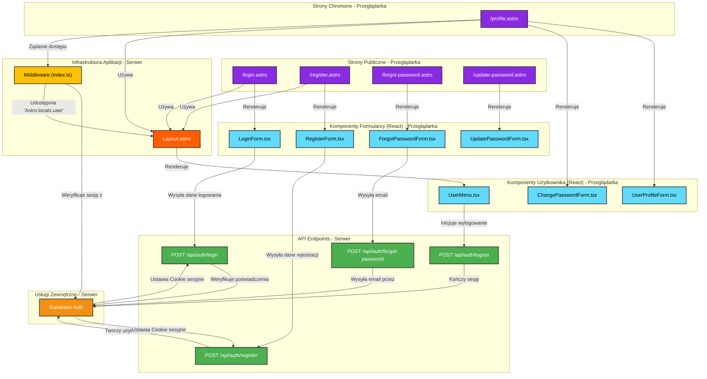

<architecture_analysis>

### 1. Komponenty, strony i layouty

Na podstawie dokumentacji `prd.en.md` oraz `auth-spec.en.md` zidentyfikowano następujące elementy biorące udział w procesie autentykacji i zarządzania użytkownikiem:

**Layouty (`./src/layouts`):**

*   `Layout.astro`: Główny layout aplikacji, który warunkowo renderuje elementy nawigacji w zależności od statusu zalogowania użytkownika (dane z `Astro.locals.user`).

**Strony (`./src/pages`):**

*   `/login.astro`: Publiczna strona z formularzem logowania.
*   `/register.astro`: Publiczna strona z formularzem rejestracji.
*   `/forgot-password.astro`: Publiczna strona z formularzem do resetowania hasła.
*   `/update-password.astro`: Publiczna strona do ustawiania nowego hasła po resecie.
*   `/profile.astro`: Chroniona strona do zarządzania profilem użytkownika (dostępna po zalogowaniu).

**Komponenty React (`./src/components`):**

*   `RegisterForm.tsx`: Formularz rejestracji z walidacją po stronie klienta.
*   `LoginForm.tsx`: Formularz logowania.
*   `ForgotPasswordForm.tsx`: Formularz do inicjowania odzyskiwania hasła.
*   `UpdatePasswordForm.tsx`: Formularz do ustawiania nowego hasła.
*   `UserProfileForm.tsx`: Formularz do zarządzania danymi profilu (CIVL ID).
*   `ChangePasswordForm.tsx`: Formularz do zmiany hasła przez zalogowanego użytkownika.
*   `UserMenu.tsx` (wewnątrz `Layout.astro`): Komponent wyświetlający menu użytkownika (Profil, Wyloguj) lub linki do logowania/rejestracji.

**API Endpoints (`./src/pages/api/auth`):**

*   `POST /api/auth/register.ts`: Obsługuje rejestrację nowego użytkownika.
*   `POST /api/auth/login.ts`: Obsługuje logowanie użytkownika i ustawia cookie sesyjne.
*   `POST /api/auth/logout.ts`: Obsługuje wylogowanie i czyści cookie sesyjne.
*   `POST /api/auth/forgot-password.ts`: Wysyła email z linkiem do resetu hasła.

**Middleware (`./src/middleware/index.ts`):**

*   Centralny punkt systemu autentykacji. Uruchamia się przy każdym żądaniu, weryfikuje sesję użytkownika na podstawie cookies i udostępnia dane użytkownika w `Astro.locals`. Chroni strony wymagające zalogowania.

### 2. Przepływ danych w procesie logowania

1.  Użytkownik wchodzi na stronę `/login.astro`.
2.  Strona renderuje komponent `LoginForm.tsx`.
3.  Użytkownik wypełnia formularz. Komponent `LoginForm.tsx` waliduje dane po stronie klienta.
4.  Po wysłaniu formularza, `LoginForm.tsx` wysyła żądanie `POST` do endpointu `/api/auth/login.ts` z emailem i hasłem.
5.  Endpoint `/api/auth/login.ts` komunikuje się z Supabase Auth w celu weryfikacji poświadczeń.
6.  Jeśli logowanie się powiedzie, Supabase ustawia w odpowiedzi nagłówek `Set-Cookie` z tokenem sesji.
7.  Endpoint API zwraca odpowiedź `200 OK`, a frontend przekierowuje użytkownika na stronę główną.
8.  Przy kolejnych żądaniach do aplikacji, middleware (`/src/middleware/index.ts`) przechwytuje żądanie.
9.  Middleware odczytuje cookie sesyjne, weryfikuje je w Supabase i jeśli jest poprawne, umieszcza dane użytkownika w `Astro.locals.user`.
10. `Layout.astro` odczytuje `Astro.locals.user` i renderuje `UserMenu.tsx` w stanie "zalogowany", wyświetlając opcje profilu i wylogowania.

### 3. Przepływ danych w procesie rejestracji

1.  Użytkownik wchodzi na stronę `/register.astro`.
2.  Strona renderuje komponent `RegisterForm.tsx`.
3.  Użytkownik wypełnia formularz (email, hasło, captcha). Komponent waliduje dane.
4.  Po wysłaniu, `RegisterForm.tsx` wysyła żądanie `POST` do `/api/auth/register.ts`.
5.  Endpoint API waliduje dane (np. za pomocą Zod) i wywołuje `supabase.auth.signUp()`.
6.  Jeśli rejestracja się powiedzie, Supabase tworzy nowego użytkownika. Użytkownik jest automatycznie zalogowany (sesja jest tworzona).
7.  Frontend przekierowuje użytkownika na stronę główną, gdzie `Layout.astro` i `UserMenu.tsx` pokazują stan "zalogowany".

</architecture_analysis>
<mermaid_diagram>

</mermaid_diagram>
