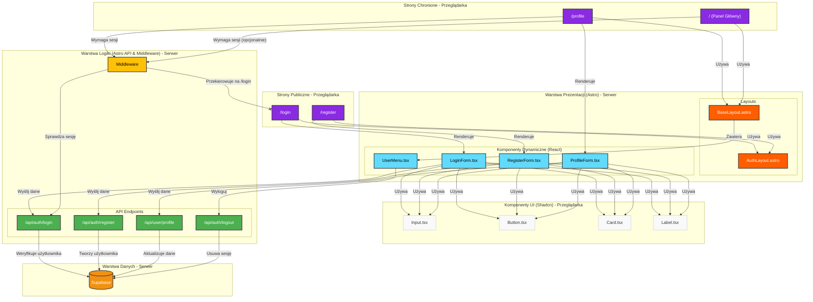

<architecture_analysis>
1.  **Lista komponentów i stron:**
    *   **Strony Astro:**
        *   `strona /login`: Strona logowania.
        *   `strona /register`: Strona rejestracji.
        *   `strona /profile`: Strona profilu użytkownika (wymaga logowania).
        *   `strona /` (Panel Główny): Strona główna, której wygląd zależy od stanu zalogowania.
    *   **Layouty Astro:**
        *   `AuthLayout.astro`: Layout dla stron autentykacji (`/login`, `/register`), zapewniający spójny wygląd.
        *   `BaseLayout.astro`: Główny layout aplikacji, używany na większości stron. Będzie zawierał komponent `UserMenu`.
    *   **Komponenty React (dynamiczne):**
        *   `LoginForm.tsx`: Formularz logowania z polami na e-mail i hasło. Zarządza walidacją i wysyłką danych.
        *   `RegisterForm.tsx`: Formularz rejestracji z polami na e-mail, hasło, potwierdzenie hasła i mechanizmem captcha.
        *   `ProfileForm.tsx`: Formularz na stronie profilu do zmiany hasła i edycji numeru CIVL ID.
        *   `UserMenu.tsx`: Komponent w nagłówku, wyświetlający status zalogowania, link do profilu i przycisk wylogowania.
    *   **Komponenty UI (Shadcn/ui - statyczne/UI):**
        *   `Input.tsx`: Pole do wprowadzania tekstu.
        *   `Button.tsx`: Przycisk.
        *   `Card.tsx`: Komponent-kontener dla formularzy.
        *   `Label.tsx`: Etykieta dla pól formularza.
    *   **Endpointy API (Astro):**
        *   `/api/auth/login`: Endpoint do obsługi logowania.
        *   `/api/auth/register`: Endpoint do obsługi rejestracji.
        *   `/api/auth/logout`: Endpoint do obsługi wylogowania.
        *   `/api/user/profile`: Endpoint do aktualizacji profilu użytkownika.
    *   **Middleware (Astro):**
        *   `src/middleware/index.ts`: Middleware do sprawdzania sesji użytkownika i ochrony tras.

2.  **Główne strony i ich komponenty:**
    *   **Strona `/login`**: Używa `AuthLayout.astro` i renderuje komponent `LoginForm.tsx`.
    *   **Strona `/register`**: Używa `AuthLayout.astro` i renderuje komponent `RegisterForm.tsx`.
    *   **Strona `/profile`**: Używa `BaseLayout.astro`, jest chroniona przez middleware i renderuje komponent `ProfileForm.tsx`.
    *   **Strona `/` (Panel Główny)**: Używa `BaseLayout.astro`, który zawiera `UserMenu.tsx`.

3.  **Przepływ danych:**
    *   Użytkownik wchodzi na stronę `/login` lub `/register`.
    *   Komponent formularza (React) obsługuje wprowadzanie danych i walidację po stronie klienta.
    *   Po wysłaniu formularza, dane są przesyłane do odpowiedniego endpointu API (`/api/auth/...`).
    *   Endpoint API (Astro) komunikuje się z bazą danych (Supabase), przetwarza żądanie (logowanie/rejestracja) i tworzy sesję, zazwyczaj poprzez ustawienie bezpiecznego ciasteczka (cookie) `httpOnly`.
    *   Po pomyślnej autentykacji, klient jest przekierowywany na stronę główną.
    *   `Middleware` na serwerze sprawdza ciasteczko sesji przy każdym żądaniu do chronionych stron (np. `/profile`) i albo pozwala na dostęp, albo przekierowuje na `/login`.
    *   Komponent `UserMenu.tsx` w `BaseLayout.astro` odczytuje stan zalogowania (np. z `Astro.locals` przekazanego z middleware) i odpowiednio renderuje interfejs (np. "Witaj, Użytkowniku" lub "Zaloguj się").

4.  **Opis funkcjonalności komponentów:**
    *   `LoginForm.tsx`: Odpowiedzialny za zebranie e-maila i hasła, walidację i komunikację z API w celu zalogowania użytkownika.
    *   `RegisterForm.tsx`: Zbiera dane rejestracyjne, weryfikuje je i wysyła do API w celu utworzenia nowego konta. Integruje się z captcha.
    *   `ProfileForm.tsx`: Umożliwia zalogowanemu użytkownikowi zmianę hasła i danych profilowych poprzez interakcję z API.
    *   `UserMenu.tsx`: Wyświetla stan autentykacji i nawigację związaną z kontem użytkownika.
    *   `AuthLayout.astro`: Zapewnia spójny szkielet wizualny dla stron logowania i rejestracji.
    *   `BaseLayout.astro`: Główny layout aplikacji.
    *   Endpointy API: Logika serwerowa dla operacji na użytkownikach i sesjach.
    *   `Middleware`: Centralny punkt do zarządzania dostępem do stron na podstawie sesji.
</architecture_analysis>

<mermaid_diagram>

</mermaid_diagram>
