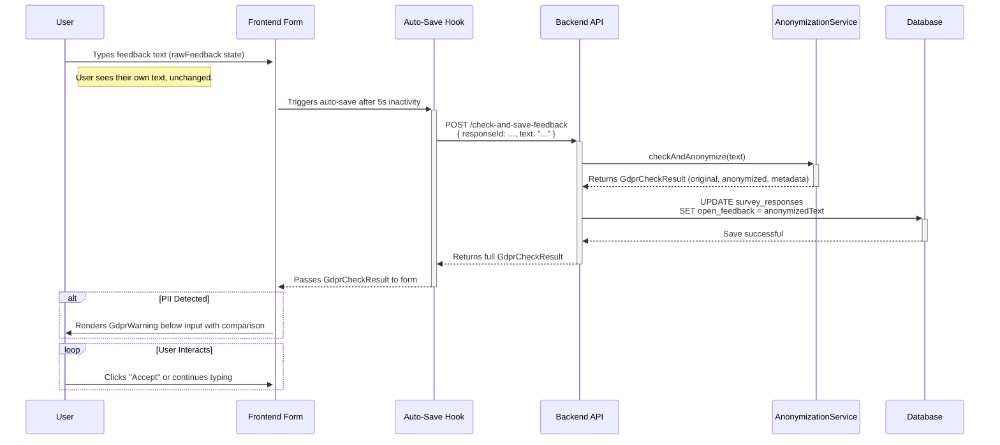

# Anonymization Service Usage (US-007) - Real-time Auto-Save Flow

This document demonstrates the updated flow for using the `anonymizationService` to fulfill US-007 requirements via real-time, non-disruptive auto-saving.

## Overview

The core idea is to perform GDPR checks and anonymization in the background during auto-save, without interrupting the user's typing flow. The user always interacts with their original text, while the database only ever stores the anonymized version.

## User Flow (US-007)

1.  **Typing**: The user types their feedback into the text area. The UI holds this in a local "raw text" state.
2.  **Auto-Save**: After 5 seconds of inactivity, the `useSurveyAutoSave` hook sends the raw text to a dedicated API endpoint.
3.  **Backend Processing**: The API endpoint:
    a.  Calls `checkAndAnonymize()` to get the `GdprCheckResult`.
    b.  Saves the `anonymizedText` (or original if no PII) to the database.
    c.  Returns the full `GdprCheckResult` to the frontend.
4.  **UI Update**:
    a.  The user's input field remains unchanged, showing their raw text.
    b.  If personal data was detected, the `GdprWarning` component appears below the input, showing the comparison.
5.  **User Action**:
    a.  **Accept Suggestion**: The user clicks "Accept", which replaces the raw text in the input field with the anonymized version. The warning disappears.
    b.  **Edit Manually**: The user edits their raw text, which triggers a new auto-save cycle.
    c.  **Ignore**: The user can ignore the warning. The database will still contain the last auto-saved anonymized version.
6.  **Final Submission**: When the user clicks "Complete Survey", the latest version from the input field is saved one last time (and anonymized if needed), and the survey is marked as complete.

## Mermaid Diagram of the Flow



## API Endpoint (New/Modified)

### POST `/api/survey-responses/check-and-save-feedback` (Example)

This new endpoint combines checking, anonymizing, and saving in one atomic operation for auto-save.

**Request:**
```json
{
  "responseId": 123,
  "text": "John Smith was a great organizer! Contact him at john@example.com"
}
```

**Behavior:**
1.  Calls `checkAndAnonymize` on the provided text.
2.  Performs `UPDATE survey_responses SET open_feedback = 'The organizer was great! ...' WHERE id = 123`.
3.  Returns the full `GdprCheckResult` to the frontend.

**Response:**
```json
{
  "containsPersonalData": true,
  "confidence": 0.98,
  "originalText": "John Smith was a great organizer! Contact him at john@example.com",
  "anonymizedText": "The organizer was great! Contact them at the provided email",
  "detectedDataTypes": ["full_name", "email"]
}
```

## Component & Hook Modifications

### `useSurveyAutoSave.ts`
-   Will be modified to call the new endpoint.
-   Will accept a new callback, e.g., `onGdprResult(result: GdprCheckResult)`, to pass the result back to the form component.

### `SurveyFillForm.tsx`
-   Will maintain a local state for the user's raw input (`rawFeedback`), separate from the `response` object that syncs with the database.
-   Will render the `GdprWarning` component based on the result from the `useSurveyAutoSave` hook.
-   Will handle the logic for the "Accept" button, which updates the `rawFeedback` state.

